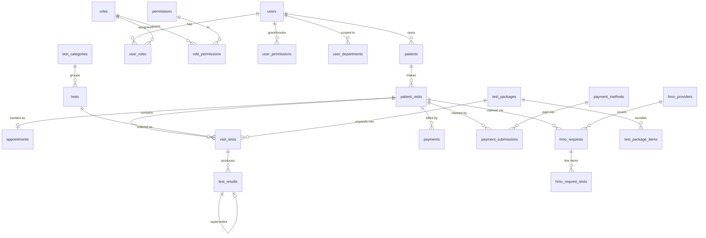
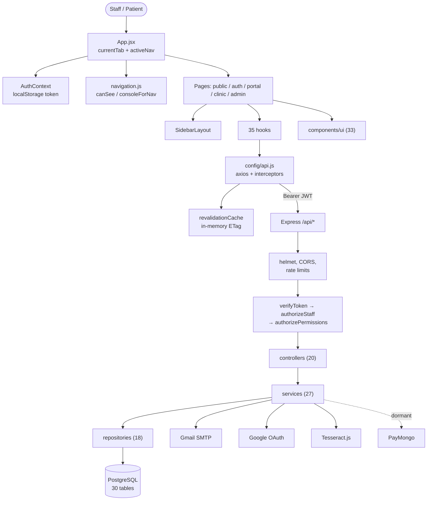
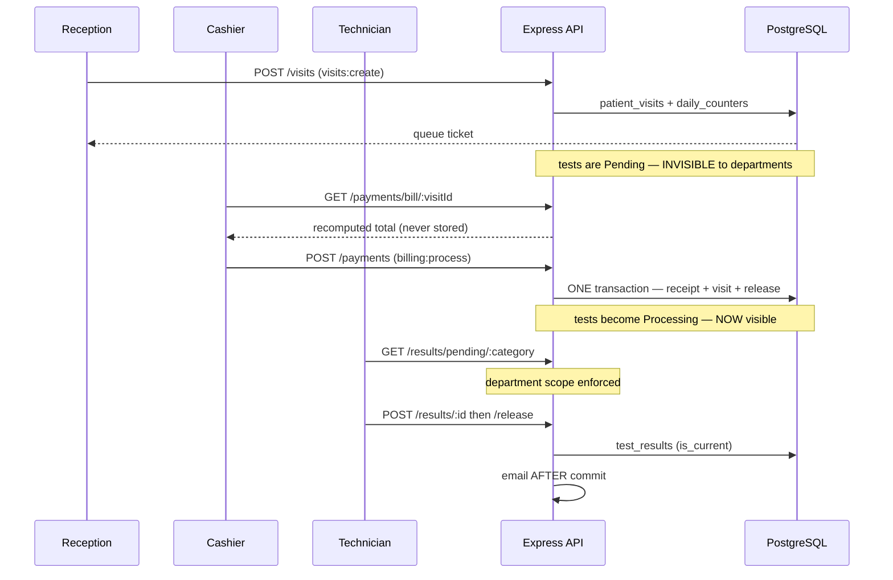

# Current System Overview

> **Purpose of this document.** It captures how the Enlogada Clinic Management System works
> **today**, so a frontend redesign can be planned without misreading the existing application.
> It is descriptive, not prescriptive. It contains no redesign proposals.
>
> **Source-of-truth labels used throughout:**
> - **[Confirmed]** — read directly in the repository, or measured against the running database.
> - **[Inferred]** — a reasonable reading of the implementation, not stated anywhere explicitly.
> - **[Unknown]** — cannot be determined from this repository.
>
> **Verified against:** `main` @ commit `fed16a1`, working tree clean.
> No application code, schema, configuration or dependency was modified to produce this document.

---

## 1. Executive Summary

**[Confirmed]** Enlogada is an operational management system for a single Philippine diagnostic
clinic offering three services only: **Laboratory, Ultrasound, and Digital X-Ray**. It is not an
EMR. It manages the operational path a patient takes through the clinic and the money and records
that path generates.

The system covers, end to end:

- Public service browsing and online appointment booking (no account needed to browse)
- Multi-patient profiles under one account (a parent booking for dependents)
- Front-desk queueing, walk-in registration, and QR-based appointment check-in
- Billing, statutory discounts, receipts, refunds, and a daily cash-up
- Manual online payment (patient uploads proof; a cashier verifies it)
- Per-modality diagnostic worklists, result entry, amendment history, and release
- HMO claim recording (manual, not an integration)
- Reporting, analytics, CSV export, and an audit log

**Scale of the codebase [Confirmed]:**

| | |
|---|---|
| Backend routes | **130** across 19 route files |
| Permission-gated routes | **77** |
| Database tables | **30** |
| Foreign keys | **48** |
| Roles / permissions | **8 roles, 32 permission rows** (31 in active use — see §24) |
| Frontend pages | 26 `.jsx` page files |
| Frontend hooks | 35 |
| Shared UI primitives | 33 in `components/ui/` |
| Tests | **318 Playwright E2E, 64 backend unit, 30 frontend unit** |

**The single most important architectural fact for a redesign [Confirmed]:** there is **no router
library**. `frontend/src/App.jsx` performs manual conditional rendering from two `useState` values
(`currentTab`, `activeNav`) plus the signed-in user's roles/permissions/departments. Navigation is
in-memory; **the URL does not change as you navigate.** This is the deepest coupling in the
frontend and the decision a redesign must make first. See §5 and §20.

---

## 2. Technology Stack

**[Confirmed]** — read from `package.json` in both workspaces.

### Frontend

| Package | Version | Role |
|---|---|---|
| `react` / `react-dom` | ^19.2.8 | UI runtime |
| `vite` | ^8.2.0 | Build tool and dev server |
| `tailwindcss` + `@tailwindcss/vite` | ^4.3.3 | Styling. **Tailwind v4** — CSS-based config, no `tailwind.config.js` |
| `axios` | ^1.19.0 | HTTP client |
| `@radix-ui/react-dialog`, `-select`, `-tabs`, `-slot` | 1.x–2.x | Headless primitives behind `components/ui/` |
| `lucide-react` | ^1.28.0 | Icon set (the only one) |
| `recharts` | ^3.10.1 | Charts |
| `sonner` | ^2.0.8 | Toasts |
| `class-variance-authority`, `clsx`, `tailwind-merge` | — | Class composition (`lib/utils.js`) |
| `qrcode`, `qrcode.react` | — | QR generation (booking pass) |
| `html5-qrcode` | ^2.3.8 | QR **scanning** (reception check-in) |
| `@react-oauth/google` | ^0.13.5 | Google sign-in button |
| `oxlint`, `playwright`, `vitest` | — | Lint and both test tiers |

### Backend

| Package | Version | Role |
|---|---|---|
| `express` | ^5.0.0 | HTTP framework |
| `pg` | ^8.11.3 | **Raw PostgreSQL driver.** No ORM, no Supabase |
| `jsonwebtoken` | ^9.0.2 | JWT issue/verify |
| `bcryptjs` | ^2.4.3 | Password hashing |
| `google-auth-library` | ^11.0.0 | Verifies Google ID tokens |
| `nodemailer` | ^9.0.5 | Outbound email via SMTP |
| `multer` | ^2.2.0 | File uploads |
| `tesseract.js` | ^7.0.0 | OCR of uploaded payment receipts |
| `helmet`, `cors`, `express-rate-limit` | — | HTTP hardening |
| `winston`, `morgan` | — | Logging |

> **[Confirmed] There is no Supabase and no ORM anywhere.** `grep` for `supabase` across both
> workspaces returns a single **stale comment** on line 2 of `database/schema.sql`
> (`-- Database: PostgreSQL (Local/Supabase hosted)`). It is not a dependency and no client exists.
> Database access is `const { Pool } = require('pg')` in `backend/src/config/database.js`.

**[Unknown]** Production hosting/deployment target. No Dockerfile, CI config, or platform config
exists in the repository.

---

## 3. Repository Structure

**[Confirmed]**

```
├── backend/
│   └── src/
│       ├── app.js                 Express app: helmet, CORS, rate limits, route mounts
│       ├── server.js              Entry point
│       ├── config/                database.js, email.js, upload.js, environment.js, logger.js
│       ├── constants/             8 files — the enforced vocabularies (roles, statuses, methods)
│       ├── controllers/           20 — parse request, call ONE service, shape response
│       ├── errors/                AppError hierarchy
│       ├── middlewares/           auth.js (4 gates), errorHandler.js
│       ├── repositories/          18 — ALL SQL lives here
│       ├── routes/                19 — endpoint definitions only
│       ├── scripts/               47 — migrations, seeds, verifiers, retention jobs
│       ├── services/              27 — ALL business logic
│       ├── utils/                 csvExport.js, reportCsv.js
│       └── validations/
├── database/
│   ├── schema.sql                 Source of truth — 30 tables
│   └── migrations.md              Human-readable change log
├── frontend/
│   ├── src/
│   │   ├── App.jsx                Manual role-based routing (235 lines)
│   │   ├── main.jsx               React root
│   │   ├── index.css              THE design system — 1,183 lines of tokens + dark mode
│   │   ├── components/            Grouped by FEATURE (see §8)
│   │   ├── config/                api.js, navigation.js, revalidationCache.js
│   │   ├── contexts/              AuthContext.jsx
│   │   ├── hooks/                 35 data hooks
│   │   ├── lib/                   20 pure utilities
│   │   ├── pages/                 public / auth / portal / clinic / admin
│   │   └── validations/
│   ├── scripts/                   checkFillRoles.js, checkContrast.js (lint gates)
│   └── tests/
│       ├── e2e/                   51 Playwright specs, 318 tests
│       └── unit/                  Vitest
├── scripts/prose_scan.py          Copy-damage scanner
└── CLAUDE.md                      Extensive engineering notes — READ THIS
```

> **[Confirmed] `CLAUDE.md` at the repository root is the most valuable single document** for
> understanding *why* the system is shaped as it is. It records decisions, measured bugs, and rules
> that are not obvious from the code. Anyone touching this codebase should read it.

---

## 4. Overall Architecture

**[Confirmed]** Two independently deployed workspaces talking over a JSON REST API.

```
Browser (React SPA, Vite dev server :5173)
    │  axios, Bearer JWT in Authorization header
    ▼
Express API (:5000, /api/*)
    │  routes → controllers → services → repositories
    ▼
PostgreSQL (raw pg pool, AsyncLocalStorage transactions)
    │
    ├── Gmail SMTP (nodemailer) — result release, booking confirmations, password reset
    ├── Google OAuth (ID token verification only)
    ├── Tesseract.js OCR (in-process, no external call)
    └── PayMongo (wired but DORMANT — see §16)
```

### Backend layering — strictly enforced [Confirmed]

`routes/` → `controllers/` → `services/` → `repositories/` → PostgreSQL

- **Routes** — endpoint definitions and guard chains only. No logic.
- **Controllers** — parse/validate the request, call **one** service, shape the response.
- **Services** — all business logic.
- **Repositories** — **all SQL.** No raw query exists outside this layer.

**[Confirmed]** Transactions use `db.withTransaction(fn)` backed by `AsyncLocalStorage`, so every
query underneath — at any call depth — runs on one connection and commits as a unit. Repositories
take no `client` argument. `pool.connect()` is never called directly in services or repositories.

---

## 5. Frontend Architecture

### 5.1 Routing — the critical coupling [Confirmed]

`frontend/src/App.jsx` (235 lines). **No router library.** Two state values drive everything:

| State | Meaning |
|---|---|
| `currentTab` | Public/portal destination: `home`, `services`, `about`, `privacy`, `terms`, `login`, `register`, `forgot-password`, `reset-password`, `account` |
| `activeNav` | Sidebar destination inside a staff console: `dashboard`, `reception-queue`, `cashier-queue`, `lab-ops`, … |

Resolution order in `App.jsx`:

1. Not signed in → render a public page or `AuthPage`.
2. Signed in as **Client** → `ClientDashboard` (or Services / About / Profile). Clients have **no
   sidebar**; they keep the public-style shell.
3. `activeNav === 'account'` → `StaffAccountSettings` (shared by every sidebar role).
4. Otherwise resolve `activeNav` → a console via `consoleForNav(...)`, falling back to
   `defaultNavForRoles(...)` if the user does not actually hold that destination.

**[Confirmed]** Routing is by **destination, not by role priority**. A user with several roles
reaches every console their roles grant. `multirole@enlogada.com` exists to exercise this.

**[Confirmed]** Only **two** URL deep links exist, both read once at mount:

| Query param | Effect |
|---|---|
| `?reset_token=…` | Opens the password-reset screen |
| `?receipt=RCT-…` | Opens `pages/ReceiptView.jsx` — one printable receipt at its own address |

Everything else is in-memory. **Reloading the page returns the user to their default screen.**

### 5.2 Authentication state [Confirmed]

`frontend/src/contexts/AuthContext.jsx` (201 lines).

- Token in `localStorage` under key `token`.
- On mount: if a token exists, `GET /auth/me` hydrates the user; a failure clears the token.
- **Re-reads `/auth/me` every 60 seconds and on `visibilitychange`.** This is what makes a
  permission grant or revoke reach a signed-in user without re-login.
- Listens for a global `auth:unauthorized` window event to clear state.
- Exposes `user`, `login`, `logout`, `googleLogin`, `updateProfile`, `changePassword`.

`user` shape consumed across the app: `{ userId, firstName, lastName, email, roles[],
permissions[], departments }`.

> **[Confirmed] `departments === null` means UNRESTRICTED (Admin/SuperAdmin). `[]` means NONE.**
> These are deliberately different and collapsing them inverts every scope check. `canSee` in
> `navigation.js` handles this explicitly.

### 5.3 API client [Confirmed]

`frontend/src/config/api.js` (81 lines) — a single axios instance.

- `baseURL`: `import.meta.env.VITE_API_BASE_URL || 'http://localhost:5000/api'`.
  **Inlined at build time** — setting it on a server after building has no effect.
- **Request interceptor** attaches `Authorization: Bearer <token>` from `localStorage`.
- **Response interceptor**:
  - Resolves `304 Not Modified` from an in-memory validator cache.
  - On **401**: removes the token, clears the revalidation cache, dispatches `auth:unauthorized`.
- `validateStatus` lets 304 reach the interceptor instead of throwing.

### 5.4 Revalidation cache [Confirmed]

`frontend/src/config/revalidationCache.js`. Four screens poll; the cache stores `ETag` validators
**in memory** (a `Map`), not via `Cache-Control`.

Reasoning recorded in the code: an on-disk HTTP cache would outlive logout and is keyed by URL
alone, so two accounts on one reception terminal would share cached patient queues. The in-memory
map is cleared on sign-out and on any 401.

Requires two CORS settings to work: `exposedHeaders: ['ETag']` and `allowedHeaders` including
`If-None-Match`. Both are present in `app.js`.

### 5.5 Data fetching [Confirmed]

No React Query / SWR / Redux. **35 bespoke hooks** in `hooks/`, each owning its own `useState` +
`useEffect` + `api` calls, typically exposing `{ data, loading, error, reload, … }`.

`hooks/usePolling.js` re-runs a callback on an interval and **pauses while `document.hidden`**,
refetching immediately on return to the tab.

### 5.6 Coupling assessment [Inferred]

| Layer | Coupling | Note |
|---|---|---|
| `App.jsx` routing | **Very high** | Every page depends on `currentTab` / `activeNav` props |
| `navigation.js` | **Very high** | Sidebar, router, and API permission checks all read it |
| `AuthContext` | **High** | Token handling and the 60s refresh are load-bearing |
| `config/api.js` | **High** | Interceptors carry auth and the 304 cache |
| Hooks | **Medium** | Reusable as-is; not tied to any particular markup |
| `components/ui/` | **Low** | Presentational primitives, replaceable |
| `index.css` | **Low** | Token layer, replaceable wholesale |

---

## 6. Current UI / Design System

**[Confirmed]** — everything visual is decided in `frontend/src/index.css` (1,183 lines) using
Tailwind v4's CSS-based `@theme` block. There is **no `tailwind.config.js`**.

### 6.1 Color tokens

**Brand ramp** (green):
```
brand-50  #f5f8f3   brand-100 #e7eee4   brand-200 #cfddc8   brand-300 #acc4a1
brand-400 #81a570   brand-500 #53843b   brand-600 #477233   brand-700 #3a5c29
brand-800 #2b451f   brand-900 #1d2e15
```

**Semantic surfaces and ink:**

| Token | Value | Role |
|---|---|---|
| `--color-canvas` | `#eaeff5` | Page background |
| `--color-surface` | `#ffffff` | Panel background |
| `--color-sunken` | `#f5f8fb` | Recessed well |
| `--color-line` | `#dbe3ec` | Hairline border |
| `--color-line-strong` | `#c8d3e0` | Emphasised border |
| `--color-line-soft` | `#e8eef5` | In-panel divider |
| `--color-ink` | `#0f172a` | Primary text |
| `--color-ink-soft` | `#475569` | Secondary text |
| `--color-ink-muted` | `#5b6b80` | Tertiary text (AA on both surfaces) |
| `--color-ink-faint` | `#78889e` | Decorative only (3:1 threshold) |
| `--color-rail` | `#16212e` | Sidebar — dark in BOTH themes |
| `--color-primary` | `#53843b` | Brand green |
| `--color-destructive` | `#e11d48` | Destructive actions |

**[Confirmed]** Tailwind's `gray-*` ramp is remapped onto `slate-*` in `@theme`, so the two neutral
ramps resolve identically.

### 6.2 Typography

- **Font:** `Outfit` (Google Fonts, weights 300–800), imported at the top of `index.css`.
- **Custom scale** (all in `rem`, so they respond to the reader's text-size setting):

| Token | Size |
|---|---|
| `--text-nano` | 0.5625rem (9px) |
| `--text-micro` | 0.625rem (10px) |
| `--text-meta` | 0.6875rem (11px) |
| `--text-fine` | 0.75rem (12px) |
| `--text-note` | 0.8125rem (13px) |
| `--text-lead` | 0.9375rem (15px) |
| `--text-stat` | 1.875rem (30px) |

> **[Confirmed] Rule enforced across the codebase: never write a font size in `px`.** The reader
> chooses a text scale (Normal / Large / Larger, `lib/textScale.js`) which works by setting a root
> font size — moving `rem` and nothing else. A pinned `px` size **inverts the hierarchy** at larger
> scales. `text-scale.spec.js` asserts `fine < note < sm` at all three scales.

### 6.3 Elevation and radius

**Shadow means "this floats."** Static panels are separated by a hairline + tinted canvas, never a
shadow.

| Token | Meaning |
|---|---|
| `--shadow-raised` | Hover lift |
| `--shadow-float` | Dropdown |
| `--shadow-overlay` | Dialog |
| `--shadow-rail` | Sidebar |

**Radius encodes size:** `md` (8px) badge → `lg` (10px) control → `xl` (14px) panel → `2xl` (18px)
dialog/hero.

### 6.4 Dark mode [Confirmed]

Toggled by stamping `data-theme="dark"` on `<html>`; the preference is read from `localStorage`
under key **`enlogada.theme`** by an inline script in `index.html` **before first paint**.

> **The entire dark-mode block is wrapped in `@media screen`, and that wrapper is a print
> guarantee.** Without it a dark theme sends near-white text to an 80mm thermal printer. Receipt
> and report components deliberately keep a literal `bg-white` because paper is white regardless of
> theme.

**[Confirmed]** Surfaces that are dark in **both** themes (the rail, hero panels, `.auth-panel`,
the public footer) must use `text-rail-ink-*` / `border-rail-line`, never themeable ink — otherwise
text inverts to dark-on-dark. `CLAUDE.md` records this as the most repeated dark-mode mistake in
the codebase.

### 6.5 Two automated design gates [Confirmed]

`npm run lint` in `frontend/` runs three things:

```
oxlint && node scripts/checkFillRoles.js && node scripts/checkContrast.js
```

| Gate | What it rejects |
|---|---|
| `checkFillRoles.js` | Ink-only shades (`slate/gray-700/800/900/950`) used as a **fill**. They invert in dark mode. Use paired tokens: `bg-emphasis text-emphasis-foreground`. Currently **198 files, 0 violations** |
| `checkContrast.js` | Any ink token failing WCAG AA against any surface it lands on, **in both themes**. Currently **44 token pairs, 0 violations** |

**A redesign that replaces the token layer must either keep these gates working or consciously
retire them.** They currently pass.

### 6.6 Component classes in `index.css`

`.glass-card`, `.dark-glass-card`, `.rail-gradient`, `.auth-panel`, `.auth-card`, `.auth-ground`,
`.disclosure`, `.animate-fade-in`, `.animate-shake`, `.animate-pulse-glow`, plus `.field-label` and
`.alert`.

### 6.7 Animation [Confirmed]

`@media (prefers-reduced-motion: reduce)` kills decorative animation — **but `.animate-spin` is
deliberately re-declared inside that query at half speed.** The blanket rule sets
`animation-iteration-count: 1` at `0.01ms`, which stops a spinner dead after one instant rotation,
making every loading indicator read as a hang. Keep this exemption.

### 6.8 `cn()` and `@theme` tokens [Confirmed]

`lib/utils.js` uses `extendTailwindMerge` with `text` and `shadow` keys registered. tailwind-merge
parses class *names* against its own model of Tailwind and cannot see `@theme`. It once read
`text-micro` as a text **colour**, collided with `text-slate-500`, and **deleted the size** — metric
labels rendered at 16px inherited instead of 10px, on every console.

> **Any new non-colour `@theme` token must also be registered in `lib/utils.js`.** Colours need no
> entry — colour is tailwind-merge's fallback guess, which is exactly what broke the sizes.

---

## 7. Pages & Routes

**[Confirmed]** "Route" below means the in-app state value, not a URL.

### 7.1 Public (no account)

| State | File | Purpose | Data |
|---|---|---|---|
| `home` | `pages/public/Home.jsx` | Landing page + hero quick-dock | `GET /visits/queue-status` (public, aggregate) |
| `services` | `pages/public/ServicesPage.jsx` | Live service catalogue | `GET /tests`, `GET /packages` |
| `about` | `pages/public/AboutUs.jsx` | Clinic information | `GET /clinic` |
| `privacy` / `terms` | `PrivacyPolicy.jsx` / `TermsOfService.jsx` | Static copy | none |

### 7.2 Auth

| State | File | Purpose |
|---|---|---|
| `login` / `register` | `pages/auth/AuthPage.jsx` | Sign in / register, plus Google button |
| `forgot-password` | `pages/auth/ForgotPassword.jsx` | Request a reset email |
| `reset-password` | `pages/auth/ResetPassword.jsx` | Complete a reset (reached via `?reset_token=`) |

### 7.3 Client portal

| State | File | Purpose | Key APIs |
|---|---|---|---|
| default | `pages/portal/ClientDashboard.jsx` | Tabbed portal: Results / Appointments / Payments / Profile | `/patients/my-profiles`, `/appointments/my-bookings`, `/payments/my-payments`, `/results/history/:patientId` |
| `account` | `pages/portal/ClientProfile.jsx` | Account settings | `/auth/me` |

### 7.4 Reception console — `pages/clinic/ReceptionistDashboard.jsx` (459 lines)

Four `activeNav` destinations: `reception-queue`, `reception-walkin`, `reception-checkin`,
`reception-history`.

- **Active Queue** — today's visits in arrival order, with elapsed wait and predicted ETA. Polls.
- **Walk-In Registration** — 388-line form: find-or-create patient, attach tests/packages, issue a
  queue ticket. Uses **container queries** (`@container`, `@md:`, `@3xl:`) so it lays out correctly
  both full-width and in the queue screen's 400px side column at `2xl`.
- **Appointment Check-In** — QR scan (`html5-qrcode`) or typed reference.
- **Visit History** — date-ranged past visits.

### 7.5 Cashier console — `pages/clinic/CashierDashboard.jsx` (246 lines)

Three destinations: `cashier-queue`, `cashier-payments`, `cashier-history`.

Composes `CollectionsStrip`, `BillingQueuePanel`, `CheckoutTerminal`, `TransactionHistoryPanel`,
`OnlinePaymentsPanel` — driven by hooks `useBillingQueue`, `useCheckout`, `useRefund`, `useReceipt`,
`usePaymentReview`, `useTransactionHistory`.

### 7.6 Diagnostic console — `pages/clinic/DiagnosticDashboard.jsx` (130 lines)

**One file serves Laboratory, X-Ray and Ultrasound**, filtered by category derived from
`activeNav` (`lab-ops`, `xray-ops`, `ultrasound-ops`, and the three `-history` variants).

### 7.7 Admin / SuperAdmin — `pages/admin/`

| File | Lines | Purpose |
|---|---|---|
| `AdminDashboard.jsx` | 311 | Overview: revenue, staff count, recent activity |
| `ServiceRequests.jsx` | 635 | HMO claim decisions |
| `PatientRecordsOversight.jsx` | 588 | Patient records + result history |
| `StaffAccounts.jsx` | 499 | Staff account management |
| `ClinicSchedule.jsx` | 479 | Weekly hours + per-date overrides |
| `CashierMonitoring.jsx` | 313 | Cashier oversight |
| `AppointmentsOversight.jsx` | 169 | All appointments |
| `ActivityLog.jsx` | 135 | Audit log |
| `ReportsOverview.jsx` | 120 | Tab shell over six report panels |
| `ServicesCatalog.jsx` | 115 | Tests and packages |
| `SuperAdminManagement.jsx` | 71 | RBAC matrix, elevated accounts, payment methods |

### 7.8 Standalone

| File | Purpose |
|---|---|
| `pages/ReceiptView.jsx` | One receipt at `?receipt=RCT-…`, printable, opens in a new tab |
| `pages/StaffAccountSettings.jsx` | Shared by every sidebar role |

---

## 8. Components

**[Confirmed]** `pages/` and `components/` are grouped **by feature, not by file type, and
deliberately not by role**. Role does not survive contact with this app: `DiagnosticDashboard`
serves three roles from one file, `pages/admin/` serves both Admin and SuperAdmin, and
`multirole@enlogada.com` holds two roles at once.

| Folder | Count | Contents |
|---|---|---|
| `components/ui/` | 33 | The shared primitive layer |
| `components/admin/` | 11 | RBAC matrix, form dialogs, panels |
| `components/portal/` | 9 | Patient-facing tabs |
| `components/reports/` | 8 | Six report panels + analytics |
| `components/cashier/` | 7 | Billing queue, checkout, proof review |
| `components/diagnostic/` | 7 | Worklist, result entry/viewer, findings |
| `components/booking/` | 5 | Booking dialog, slot picker, test picker |
| `components/reception/` | 5 | Queue, walk-in, check-in |
| `components/charts/` | 4 | Recharts wrappers + `chartTheme.js` |
| `components/` (root) | 15 | `SidebarLayout`, `Receipt`, `DiagnosticReport`, `BookingPass`, … |

### 8.1 Layout shell

**`components/SidebarLayout.jsx` (619 lines)** — the shared shell for every staff/admin console.

```jsx
<SidebarLayout title activeNav onSelectNav>{children}</SidebarLayout>
```

Provides: the dark rail with collapsible department groups (remembered in `localStorage`; the group
holding the current screen always opens), a **breadcrumb** top bar, the notification bell, theme
toggle, text-scale control, date display, and the user block linking to account settings.

> **[Confirmed]** The top bar is a **breadcrumb, not a second page title**. Each screen's own
> `PageHeader` carries the heading. Do not put a title in both.

`DashboardLayout.jsx`, `PublicHeader.jsx`, `PublicFooter.jsx` are the public-page equivalents.

### 8.2 The primitive layer — `components/ui/`

Each exists because the markup it replaced had been copy-pasted 15–40 times and the copies drifted.

| Primitive | Function |
|---|---|
| `page-header.jsx` | Opens every screen — eyebrow, title, description, actions. `variant="hero"` for two landing screens |
| `panel.jsx` | Section container: `Panel` / `PanelHeader` / `PanelBody` / `PanelFooter`. `<PanelBody flush>` for tables |
| `toolbar.jsx` | Filter row above a worklist. Exports `SegmentedFilter`, `ToolbarField` |
| `empty-state.jsx` | Nothing-to-show state. **`tone="error"` looks deliberately unlike empty** — a failed request and a quiet morning must never be confusable |
| `button.jsx` | `<Button loading>` — spinner, disable, `aria-busy`, and **the label stays put** (swapping it for "Saving…" erased which action had been confirmed) |
| `dialog.jsx` / `confirm-dialog.jsx` | Radix Dialog wrappers |
| `table.jsx` | Table with `overflow-auto` container |
| `status-badge.jsx` | Status tone **paired with a glyph** — colour alone fails colour-blind users |
| `data-badge.jsx` | One treatment for every code read aloud (queue tickets, receipts, references). Monospace + `tabular-nums` + AA contrast. Optional copy button |
| `wait-badge.jsx` | Elapsed wait, with escalation thresholds and an icon change |
| `eta-badge.jsx` | Predicted wait — sibling to `wait-badge`, matched in shape |
| `appointment-time.jsx` | Two-tier "Scheduled service time / Recommended arrival" |
| `date-field.jsx` / `calendar.jsx` | Keeps native `<input type="date">` and replaces only the picker, so ISO values, `min`/`max`, `required` and the phone OS picker all still work |
| `metric-card.jsx` | KPI tile (`tabular-nums`) |
| `loading-state.jsx`, `skeleton.jsx` | Loading |
| `export-csv-button.jsx` | Report download |
| `theme-toggle.jsx`, `text-scale-control.jsx` | Reader preferences |

### 8.3 Print-specific components [Confirmed]

`Receipt.jsx`, `DiagnosticReport.jsx`, `ResultDocument.jsx`, `ReceiptView.jsx`.

> **Printing uses `lib/printArea.js`, never a print stylesheet alone.** `printElement()` copies the
> node to a child of `<body>`, `display:none`s every sibling, prints, then tears the copy down in a
> `finally`. A **copy**, because relocating a live node is a mutation React did not perform.
> `display`, not `visibility`, because only `display` removes the layout.
>
> The bug this fixed: the receipt printed the letterhead and then a blank sheet, and no test could
> see it because the defect lived entirely in `@media print`.

---

## 9. Frontend State & Data Flow

**[Confirmed]** Four layers, no global store.

| Layer | Mechanism |
|---|---|
| Auth | `AuthContext` (React Context) |
| Navigation | `useState` in `App.jsx` |
| Server data | 35 bespoke hooks, each with local `useState` |
| Reader preferences | `localStorage` + `useSyncExternalStore` (`lib/textScale.js`, `lib/clinic.js`) |

Typical flow:

```
Component mounts
  → hook useEffect fires
  → api.get(...) — interceptor adds Bearer token
  → 200 (or 304 resolved from the in-memory cache)
  → hook setState
  → component renders { loading | error | empty | data }
```

**[Confirmed] `localStorage` keys in use:** `token`, `enlogada.theme`, the text-scale key, and the
sidebar collapsed-groups key.

---

## 10. Frontend → API Dependency Map

**[Confirmed]** Traced through the actual imports and route definitions.

### Reception — Active Queue
```
ReceptionistDashboard → ActiveQueuePanel
  ↓ useReceptionQueue (polls)
GET /api/visits/active            perm[visits:read]
  ↓ visitController.getActiveVisits
  ↓ visitService.getActiveVisits → queueEstimateService.annotate
  ↓ visitRepository.findActiveVisits
patient_visits ⋈ patients ⋈ visit_tests ⋈ tests
```

### Reception — Walk-in registration
```
WalkInRegistration
  ↓ POST /api/patients             perm[patients:create]
  ↓ POST /api/visits               perm[visits:create]   → issues queue ticket from daily_counters
  ↓ POST /api/tests/visit-tests    perm[tests:assign]
patients, patient_visits, visit_tests, daily_counters
```

### Cashier — Checkout
```
CashierDashboard → CheckoutTerminal
  ↓ useCheckout
GET  /api/payments/bill/:visitId   perm[billing:read]     → recomputed bill
POST /api/payments                 perm[billing:process]
  ↓ paymentController.processPayment
  ↓ paymentService.processPayment  (withTransaction)
  ↓ paymentRepository + visitRepository.releaseVisitToModalities
payments, patient_visits, visit_tests, daily_counters
```

### Cashier — Online payment review
```
OnlinePaymentsPanel → ProofReviewDialog
GET  /api/payment-submissions/pending   perm[billing:read]
GET  /api/payment-submissions/:id/proof (auth'd blob fetch — NOT a bare )
POST /api/payment-submissions/:id/verify perm[billing:process]
  ↓ paymentSubmissionService.verify → paymentService.processPayment
payment_submissions, payments, patient_visits
```

### Diagnostic — Worklist and release
```
DiagnosticDashboard → WorklistPanel / ResultEntryDialog
GET  /api/results/pending/:category      perm[results:read]  + department scope
POST /api/results/:visitTestId           perm[results:write] (multipart)
POST /api/results/:visitTestId/release   perm[results:release]
  ↓ resultService.releaseResult (withTransaction; email AFTER commit)
test_results, visit_tests, patient_visits
```

### Client — Booking
```
BookingDialog → SlotPicker / TestPicker
GET  /api/appointments/availability?date=…   token
POST /api/appointments                       token (+ optional HMO card upload)
  ↓ appointmentService.createAppointment (withTransaction)
patient_visits, appointments, visit_tests, hmo_requests
```

### Admin — Reports
```
ReportsOverview → six panels
GET /api/reports/summary         perm[reports:view]   (+ ?format=csv)
GET /api/reports/staff-workload  perm[reports:view]
GET /api/reports/hmo-claims      perm[reports:view]
GET /api/reports/operations      staff (per-slice permission gating inside)
GET /api/reports/analytics       staff
payments, patient_visits, visit_tests, test_results, hmo_requests
```

### File uploads [Confirmed]
| Endpoint | Field | Limit |
|---|---|---|
| `POST /auth/me/avatar` | avatar | 3 MB |
| `POST /results/:visitTestId` | result file | 15 MB |
| `POST /appointments`, `POST /hmo/request` | HMO card | 8 MB |
| `POST /payment-submissions` | proof | 8 MB |
| `POST /payment-methods/:id/qr` | QR image | 8 MB |
| `POST /payments/scan-receipt` | OCR scan | 6 MB, **memoryStorage — persists nothing** |

### Not present [Confirmed]
**No WebSockets. No server-sent events. No GraphQL.** Live-feeling screens use polling +
ETag revalidation. One inbound webhook exists (`POST /payments/gateway/webhook`), consumed by
PayMongo, not by the frontend.

---

## 11. API Contracts

**[Confirmed]** Uniform envelopes.

```jsonc
// Success
{ "status": "success", "data": { "<key>": ... } }

// Error  (middlewares/errorHandler.js)
{ "status": "error", "statusCode": 404, "message": "Visit not found" }
```

The `data` key is **named per endpoint** (`{ methods }`, `{ submissions }`, `{ visits }`,
`{ versions }`, `{ queue }`…), not a bare payload. A redesign must keep unwrapping by the same key.

> **[Confirmed]** In production a 4xx message is shown; a 5xx message is replaced with
> "Something went wrong". `expose` is set by the error classes (true for 4xx); the legacy
> `statusCode` idiom falls back to `operational && statusCode < 500`. Stack traces appear only in
> development.

---

### `POST /api/auth/login`
- **Purpose** — sign in.
- **Request** — `{ email, password }`
- **Response** — `{ status, data: { token, user } }`
- **Auth** — none. **Rate limited**: `authLimiter`, counts **failed** attempts only.
- **Consumers** — `AuthContext.login`, `AuthPage`.
- **Flow** — `authController.login` → `authService.login` → `userRepository.findByEmail` + bcrypt.
- **Behaviour** — the JWT proves **identity only**; roles/permissions are re-read on every request.
- **Failures** — `401` bad credentials (same message for unknown email and wrong password, so the
  response cannot enumerate accounts), `423` locked out, `403` deactivated.

### `GET /api/auth/me`
- **Purpose** — resolve the current user, roles, permissions, departments.
- **Auth** — Bearer token.
- **Response** — `{ status, data: { user: { userId, firstName, lastName, email, roles[], permissions[], departments } } }`
- **Consumers** — `AuthContext` on mount, **every 60s**, and on tab focus.
- **Behaviour** — **`departments: null` = unrestricted; `[]` = none.** Not interchangeable.

### `GET /api/visits/active`
- **Purpose** — today's queue for the front desk.
- **Request** — `?search=&status=&limit=&offset=`
- **Response** — `{ data: { visits[], total, pendingCount, processingCount, walkinCount } }` —
  counts are computed **server-side** so pagination does not break the KPI cards.
- **Auth/Authz** — token + staff + `visits:read`.
- **Behaviour** — each row is annotated by `queueEstimateService` with
  `estimated_wait_minutes`, `patients_ahead`, `estimate_is_capped`, `estimate_basis`.
  **A non-Pending visit gets `null`, not `0`** — zero reads as "no wait", which is a claim rather
  than an absence.

### `GET /api/visits/queue-status`  *(the only public `/visits` route)*
- **Purpose** — "how busy is the clinic right now" for the public home page.
- **Auth** — **none**.
- **Response** — `{ data: { queue: { waiting, inProgress, estimatedWaitMinutes, estimateIsCapped, estimateBasis, asOf } } }`
- **Behaviour** — aggregate only: no name, no ticket, no id. The privacy control is the SQL
  (`countActiveForPublicStatus` selects two integers), not the route.

### `GET /api/payments/bill/:visitId`
- **Purpose** — what a visit owes **right now**.
- **Auth/Authz** — token + staff + `billing:read`.
- **Response** — `{ data: { subtotal, hmoCoverage, discount{}, netDue, tests[] } }`
- **Behaviour** — **never a stored total.** Derived from `visit_tests.price_at_time` plus live HMO
  and discount state, so a test added between opening the screen and pressing pay cannot leave a
  stale amount.

### `POST /api/payments`
- **Purpose** — take a payment, issue a receipt, release the visit to the modalities.
- **Request** — `{ patientVisitId, paymentMethod, referenceNumber?, amount }`
- **Auth/Authz** — token + staff + `billing:process`.
- **Behaviour**
  - `paymentMethod` ∈ `Cash | GCash | Bank`.
  - `amount` is **rejected if it differs from the recomputed bill by more than ₱0.01**.
  - Receipt number comes from `daily_counters` via `INSERT … ON CONFLICT DO UPDATE … RETURNING` —
    never `COUNT(*) + 1`, which races and **rewinds** on refund.
  - `uq_payments_one_paid_per_visit` allows one settled row per visit.
  - Runs in one transaction: receipt + visit status + modality release commit together.
- **Failures** — `409` already paid, `400` amount mismatch.

### `GET /api/payments/transactions`
- **Response** — `{ data: { transactions[], summary{} } }`
- **Behaviour** — **the money total comes from `summary`, never from reducing `transactions`.**
  The list is a log of receipts *issued* and includes reversed ones. `summary` is aggregated in SQL
  over settled rows and across the whole date range, so it stays right on a paged call.

### `POST /api/payment-submissions`
- **Purpose** — a patient claims they have paid, with a screenshot.
- **Request** — multipart: `patientVisitId`, `paymentMethodId?`, `referenceNumber`,
  `amountClaimed`, file.
- **Authz** — `billing:submit_proof` + role list including `Client`.
- **Behaviour** — **`amountClaimed` is EVIDENCE, never the amount charged.** Verification runs
  `paymentService.processPayment` on the recomputed bill. `uq_paysub_one_live_per_visit` (partial)
  allows one Pending claim per visit.

### `GET /api/payment-methods`
- **Auth** — **public**, active only.
- **Response** — `{ data: { methods[] } }` with `kind`, `label`, `account_number`, `account_name`,
  `bank_name`, `instructions`.
- **Behaviour** — `kind` ∈ **`GCash | Bank`** for anything publishable. Writes are **SuperAdmin
  only and audited** — it is where a patient's money is sent.

### `GET /api/results/pending/:category`
- **Authz** — token + staff + `results:read`, **plus department scope**
  (`resultService.assertStaffAllowedCategory`). A lab account asking for X-Ray is **refused**, not
  shown an empty list.
- **Behaviour** — only tickets the cashier has **released**. An unpaid visit is invisible here.

### `GET /api/results/:visitTestId/versions`
- **Purpose** — the amendment chain.
- **Response** — `{ data: { versions[] } }`, **newest first**, each with `version`, `is_current`,
  `findings`, `amendment_reason`, `is_critical`, recorder and releaser names.
- **Behaviour** — exactly one row has `is_current: true`. This is the **only intentional reader of
  superseded rows**; every other query must filter on `is_current`.

### `GET /api/reports/*`
- **Five endpoints**: `summary`, `staff-workload`, `hmo-claims`, `operations`, `analytics`.
- **Behaviour** — all accept **`?format=csv`**. The format decision happens in the controller
  **after** the service returns, so an export can never see figures the JSON could not.
  `Content-Disposition` must stay in the CORS `exposedHeaders` or the browser cannot read the
  filename.

### `GET /api/clinic`
- **Auth** — **public**.
- **Response** — `{ data: { clinic: { name, shortName, address, phone, email, proprietor,
  vatRegistered, arrivalLeadMinutes, tin, businessPermit, accreditation } } }` — every field a
  string, blank when unset.
- **Behaviour** — `vatRegistered` **decides discount arithmetic**. `arrivalLeadMinutes` is the
  clinic-wide arrival policy. Statutory identifiers are deliberately **blank unless configured**.

---

## 12. Backend Architecture

**[Confirmed]**

### Middleware order in `app.js`
```
helmet({ contentSecurityPolicy: false })
  → cors({ origin: allow-list, credentials: true,
           exposedHeaders: ['ETag', 'Content-Disposition'],
           allowedHeaders: ['Content-Type','Authorization','If-None-Match'] })
  → express.json / urlencoded
  → morgan
  → rateLimit  (100/15min production, 20000 dev)
  → authLimiter on /auth/login, /forgot-password, /reset-password
       (10 prod / 2000 dev, skipSuccessfulRequests: true)
  → 21 route mounts under /api/*
  → errorHandler
```

**[Confirmed]** An unknown CORS origin **withholds the header rather than raising**, because an
error there surfaces as a 500 and tells the caller more than it should.

### Transactions
`db.withTransaction(fn)` — `AsyncLocalStorage`-scoped. Nested calls join the transaction in
progress. bcrypt hashing and outbound email/HTTP are kept **outside**, so a pooled connection is
not held during slow work.

**`createAppointment` is the shape to copy for "commit, then do the after-work"**: everything that
must only happen after a successful commit (staff notification, discarding an unused upload) sits
**after** the `try`, not inside it.

### Uploads [Confirmed]
`config/upload.js`. **A stored filename is never derived from what the client sent**, and no upload
is served statically. Filenames are random hex plus an extension mapped from the **validated** MIME
type, with containment re-checked via `assertInside`.

> The bug this fixed: the extension came from `file.originalname`, which combined with a
> `%2F`-encoded route param let a request choose both directory and suffix — and multer writes
> **before** the controller's authorization check runs, so the 403 arrived after the file was on
> disk.

---

## 13. Business Logic

**[Confirmed]** All of the following lives on the **backend** and must not be reimplemented in a
redesigned frontend.

### Money
| Rule | Where |
|---|---|
| The bill is **always recomputed**, never stored | `paymentService.getBillingSummary` |
| Submitted amount must match within ₱0.01 | `paymentService.processPayment` |
| Receipt/queue numbers come from `daily_counters`, never `COUNT(*)+1` | repositories |
| One settled payment per visit (`uq_payments_one_paid_per_visit`) | database |
| A reversal stamps `refunded_at`; `paid_at` is never rewritten, so a closed day is never restated | `[1.30.0]` |
| `reversed` is reported **beside** `collected`, never netted off it | `reportRepository` |
| Money totals come from a SQL `summary`, never from reducing a list | `paymentRepository` |

### Statutory discounts
> **The clinic is NON-VAT registered**, and that changes what a senior pays.
> For a VAT-registered establishment RA 9994 / RA 10754 strip 12% VAT **first**, then apply 20% —
> ₱714.29 on a ₱1,000 service. Enlogada is not registered, so the 20% comes off the full price:
> **₱800.00**. `discountService` branches on `CLINIC_VAT_REGISTERED` at one line.
>
> **Any UI asserting discount arithmetic must read `GET /api/clinic → vatRegistered`, never assume.**

### Packages
A package is **not** a `tests` row — it would have one `category_id` and half the work would never
reach its department. `packageService.attachPackages` expands a package into **one `visit_tests` row
per component**, with the fixed price spread across components in proportion to list prices and the
remainder on the largest, so the parts sum to the package price **exactly**.

### Visit lifecycle
`VISIT_STATUSES = ['Pending', 'Processing', 'Completed', 'Cancelled']`

> **A PAID visit is finished in both directions.** Tests cannot be added to it **or** removed from
> it. Removal would change a bill the patient holds a receipt for. Adding was a measured revenue
> leak: the new row was created `Processing` and released straight to the worklist, the bill did not
> move, and `POST /payments` then refused. Both directions now `409` with the remedy named.

### Results
`chk_visit_tests_status` = `Pending | Approved | Processing | Waiting for Release | Completed | Cancelled`

Modality staff may set only `MODALITY_SETTABLE_TEST_STATUSES = ['Waiting for Release', 'Completed']`
— a ticket **arrives** `Processing`, put there by the payment release, so staff cannot pull an
unreleased ticket into their own queue.

**`test_results` is versioned — always filter on `is_current`.** A `LEFT JOIN test_results` without
`AND tr.is_current` repeats the parent row per amendment and shows superseded findings beside live
ones.

### HMO
> **An HMO claim is a RECEIVABLE and must never be added to takings.** An approved claim never
> reaches `payments`. `GET /reports/hmo-claims` reports `approved` / `pending` / `refused` beside
> `collected` and never sums them.
>
> **Two columns decide a claim independently and BOTH decide the money:** `hmo_requests.status` and
> `hmo_request_tests.approval_status`. An HMO routinely clears a claim while refusing one line.
> A refusal at either level wins.

### Logic currently in the FRONTEND [Confirmed]
Presentational only — safe to move or rewrite:
`lib/currency.js` (formatting), `lib/date.js`, `lib/abnormalValues.js` (highlighting only — it
never writes and never replaces the critical-value workflow), `lib/appointmentTime.js`,
`lib/preparation.js`, `lib/collections.js`, `validations/patientValidation.js` (**client-side
convenience; the server validates independently**).

### Date handling — a repeated bug class [Confirmed]
> **Never use `toISOString()` for "today".** It returns the **UTC** date, which in Philippine time
> (UTC+8) is *yesterday* between midnight and 08:00 — silently. Postgres `CURRENT_DATE` is the
> server's local date, so the two disagree every morning. This shipped **twice**.
>
> Frontend uses `lib/date.js` (`todayStr`, `daysAgoStr`) built from local getters; backend derives
> date strings **in SQL**.

> **Never filter on `column::date`.** A B-tree index cannot serve a predicate on an expression.
> Measured at 219k rows: **50.7ms** sequential scan vs **0.84ms** index scan. Use half-open ranges.

---

## 14. Database Architecture

**[Confirmed]** PostgreSQL, **30 tables, 48 foreign keys**. `database/schema.sql` is the source of
truth (verified in `[1.54.0]` by building a throwaway database and diffing tables, columns, indexes
and constraints — all four matched exactly).

### Core flow
```
users ──1:N──> patients ──1:N──> patient_visits ──1:N──> visit_tests ──1:N──> test_results
                                       │                      │
                                       ├──1:N──> payments     └──> tests ──> test_categories
                                       ├──1:1──> appointments
                                       └──1:N──> hmo_requests ──> hmo_request_tests
```

> **[Confirmed] `users → patients` is 1:N.** One account owns several profiles (a parent booking
> for dependents). `GET /patients/my-profiles` is plural for this reason, and **ownership checks
> must compare per-patient, never resolve a user to a single patient.**

### Table groups

| Group | Tables |
|---|---|
| Identity & access | `users`, `roles`, `user_roles`, `permissions`, `role_permissions`, `user_permissions`, `user_departments`, `password_reset_tokens` |
| Patients | `patients`, `patient_types` |
| Visits | `patient_visits`, `appointments`, `daily_counters` |
| Catalogue | `tests`, `test_categories`, `test_packages`, `test_package_items` |
| Work | `visit_tests`, `test_results` |
| Money | `payments`, `payment_methods`, `payment_submissions`, `discount_types` |
| HMO | `hmo_providers`, `hmo_requests`, `hmo_request_tests` |
| Clinic ops | `clinic_operating_hours`, `clinic_schedule_overrides` |
| System | `notification_events`, `notification_reads`, `audit_log` |

### Enforced vocabularies (DB `CHECK` constraints) [Confirmed]

| Constraint | Values |
|---|---|
| `chk_visits_status` | `Pending, Processing, Completed, Cancelled` |
| `chk_visits_type` | `Walk in, Appointment` |
| `chk_appointments_status` | `Pending, Confirmed, Completed, Cancelled, No Show` |
| `chk_visit_tests_status` | `Pending, Approved, Processing, Waiting for Release, Completed, Cancelled` |
| `chk_payment_method` | `Cash, GCash, Bank` |
| `chk_payment_status` | `Pending, Paid, Failed, Refunded, Cancelled` |
| `chk_payment_methods_kind` | `Cash, GCash, Bank` (publishable subset is narrower — §24) |
| `chk_paysub_status` | `Pending, Verified, Rejected` |
| `chk_hmo_status` | `Pending, Approved, Rejected, Cancelled` |
| `chk_hmo_request_tests_status` | `Pending, Approved, Rejected` |
| `chk_patients_sex` | `Male, Female` |
| `chk_user_permissions_effect` | `grant, revoke` |

### Simplified ER diagram



---

## 15. Authentication & Authorization

**[Confirmed]**

### Login
1. `POST /api/auth/login` → bcrypt compare.
2. Server issues a JWT (`JWT_SECRET`, `JWT_EXPIRES_IN`).
3. Frontend stores it in `localStorage` under `token`.
4. Every request carries `Authorization: Bearer <token>`.

**No cookies. No CSRF middleware** — the API is stateless and bearer-token based. **[Confirmed] a
`grep` for `csrf` across both workspaces returns nothing.**

**[Confirmed] There is no refresh-token mechanism.** The token expires and the user signs in again.

### The four gates — `backend/src/middlewares/auth.js`

| Gate | Question | Refuses with |
|---|---|---|
| `verifyToken` | Who is this? Decodes the JWT and **re-reads roles, permissions and departments from the database** | 401 / 403 |
| `authorizeRoles(...)` | Do they hold one of these roles? | 403 |
| `authorizeStaff` | Are they staff at all? (any role that is not `Client`) | 403 |
| `authorizePermissions(...)` | Do they hold **all** these permissions? | 403 |

`verifyToken` refuses in four **distinguishable** ways: no/invalid token (401), account deleted
(401), account deactivated (403), **token predates a password change (401)** — the last is what
makes "reset the password" a real answer to a stolen token.

> **[Confirmed] SuperAdmin bypasses the permission layer; Admin does not.** That single difference
> is what separates the two roles.

### Three orthogonal axes, resolved server-side in `userRepository`
| Axis | Meaning |
|---|---|
| `roles` | Structural — staff or patient. Not editable from any screen |
| `permissions` | Role template **plus** the account's grants **minus** its revokes. Revoke applied last, so a conflict resolves to *less* access |
| `departments` | Modalities implied by roles plus `user_departments`. **`null` = unrestricted, `[]` = none** |

### Live matrix (read from the database)

| Role | Permissions |
|---|---|
| SuperAdmin | 31 |
| Admin | 26 |
| Receptionist | 18 |
| Client | 14 |
| Cashier | 9 |
| Laboratory / Ultrasound / Xray Staff | 6 each |

`user_permissions` and `user_departments` currently hold **0 rows** — no per-account exceptions are
in use, though the mechanism exists and is audited.

### Verification tooling [Confirmed]
`node src/scripts/verifyRbacWiring.js` performs five checks: the permission exists; a staff role
holds it; every role named on a route holds it; **every role holding it appears on the route**
(warns, with a `// rbac-narrowing:` opt-out); and every `permission:` in `navigation.js` is one the
API enforces. **Currently reports "All good" with zero warnings.**

### Logout
`AuthContext.logout()` clears `localStorage`, clears the revalidation cache, resets user state. **No
server call** — the token simply stops being sent.

---

## 16. External Services

**[Confirmed]**

| Service | Status | Notes |
|---|---|---|
| **Gmail SMTP** (nodemailer) | **LIVE** | Released results, booking confirmations, password resets. `SMTP_USER`/`SMTP_PASS`/`SMTP_FROM`, with `EMAIL_*` accepted as aliases. `sendEmail` requires **both** halves and names the missing one |
| **Google OAuth** | **LIVE** | `POST /auth/google` verifies an ID token via `google-auth-library`, then logs in or auto-creates a Client |
| **Tesseract.js OCR** | **LIVE** | In-process. Reads an uploaded receipt to pre-fill a reference. **Has no write in it, by design.** Uses `memoryStorage` and persists nothing |
| **PayMongo** | **DORMANT** | Fully wired, mounted, unflagged — dormant purely because the secrets are blank. `isConfigured()` requires **both** `PAYMONGO_SECRET_KEY` and `PAYMONGO_WEBHOOK_SECRET`; half-configured fails safe and logs which half is missing |

> **[Confirmed] Manual proof of payment is the live online channel; the gateway is not.**
> SuperAdmin publishes GCash/bank details and a QR; the patient uploads a screenshot plus reference;
> a cashier verifies it. Approval runs the **existing** `paymentService.processPayment` — never a
> parallel money writer.

**[Confirmed] The patient portal has no notification bell.** `notifyRoles` writes to staff, who have
a bell in `SidebarLayout`. A Client does not, so an in-app notification addressed to one is a row
nobody can see. **Anything a patient must be told goes through email.**

### Environment variable names (names only, never values)

**Backend:** `DATABASE_URL`, `JWT_SECRET`, `JWT_EXPIRES_IN`, `NODE_ENV`, `PORT`, `FRONTEND_URL`,
`CORS_ORIGINS`, `PGPOOL_MAX`, `PG_STATEMENT_TIMEOUT_MS`, `SMTP_HOST`, `SMTP_PORT`, `SMTP_USER`,
`SMTP_PASS`, `SMTP_FROM`, `EMAIL_HOST`, `EMAIL_PORT`, `EMAIL_USER`, `EMAIL_PASS`,
`EMAIL_APP_PASSWORD`, `EMAIL_FROM`, `GOOGLE_CLIENT_ID`, `GOOGLE_CLIENT_SECRET`,
`PAYMONGO_SECRET_KEY`, `PAYMONGO_WEBHOOK_SECRET`, `PAYMONGO_API_BASE`, `CLINIC_VAT_REGISTERED`,
`VAT_RATE`, `ARRIVAL_LEAD_MINUTES`, `TURNAROUND_TARGETS`, `CLINIC_NAME`, `CLINIC_SHORT_NAME`,
`CLINIC_ADDRESS`, `CLINIC_PHONE`, `CLINIC_EMAIL`, `CLINIC_PROPRIETOR`, `CLINIC_TIN`,
`CLINIC_PERMIT`, `CLINIC_ACCREDITATION`.

**Frontend:** `VITE_API_BASE_URL`, `VITE_GOOGLE_CLIENT_ID`.

> `VITE_API_BASE_URL` is **inlined at build time**. It must be set before `npm run build`.

**[Confirmed]** The backend **refuses to start** if `JWT_SECRET` is blank, shorter than 32
characters, or a known example value.

---

## 17. Important User Flows

**[Confirmed]**

### Login
```
Enter credentials → AuthContext.login → POST /auth/login
  → authService.login (bcrypt, lockout check, active check)
  → users, user_roles, role_permissions, user_permissions, user_departments
  → { token, user } → localStorage.setItem('token') → setUser
  → App.jsx re-renders into the role's default console
```

### Online booking
```
Client picks date → GET /appointments/availability?date=
  → clinic_operating_hours + clinic_schedule_overrides + existing appointments
  → slots[] (EVERY slot, each flagged — so a taken slot shows as taken)
Client picks tests/packages → POST /appointments (multipart if an HMO card)
  → ONE transaction: patient_visits + appointments + visit_tests + hmo_requests
  → AFTER commit: staff notification, discard unused upload
  → BookingConfirmation with reference + QR
```

### Walk-in → payment → result release (the core clinic path)
```
Reception registers → POST /patients, POST /visits (queue ticket), POST /tests/visit-tests
  → visit is Pending, tests are Pending — INVISIBLE to the departments
Cashier → GET /payments/bill/:visitId (recomputed) → POST /payments
  → transaction: receipt number + visit Processing + visit_tests Processing
  → the tests now APPEAR on the modality worklists
Technician → GET /results/pending/:category (department-scoped)
  → POST /results/:visitTestId (findings, optional file)
  → POST /results/:visitTestId/release
  → transaction: test_results.is_current; last test completes the VISIT
  → AFTER commit: email to the patient
```

### Manual online payment
```
Patient → GET /payment-methods (public) → picks a channel, copies the account number
  → optional POST /payments/scan-receipt (OCR pre-fills the reference; never writes)
  → POST /payment-submissions (multipart proof) → status Pending, NO money moves
Cashier → GET /payment-submissions/pending  (each row carries amount_claimed AND amount_due
                                             AND duplicate_count)
  → GET /payment-submissions/:id/proof (authenticated blob)
  → POST /payment-submissions/:id/verify
  → paymentService.processPayment on the RECOMPUTED bill, not the claim
```

### Password reset
```
POST /auth/forgot-password → token generated, only its HASH stored → email with ?reset_token=
User opens link → App.jsx reads the param at mount → ResetPassword
POST /auth/reset-password → stamps password_changed_at
  → every existing JWT for that user is now rejected by verifyToken
```

---

## 18. What Can Be Redesigned

**[Inferred]** from the coupling analysis — these carry no backend contract.

| Area | Why it is safe |
|---|---|
| **All CSS / the whole token layer** | `index.css` is self-contained; nothing server-side reads it |
| **Colours, typography, spacing, radius, shadows** | Presentational only |
| **Component markup and hierarchy** | `components/ui/` are presentational wrappers |
| **Layout and grid** | No backend dependency |
| **Sidebar / header visual design** | The *structure* comes from `navigation.js`; the *appearance* does not |
| **Responsive behaviour and breakpoints** | Purely visual |
| **Animation** | Subject only to the `prefers-reduced-motion` + spinner rule |
| **Icon set** | `lucide-react` is used throughout but nothing depends on it |
| **Charts** | Recharts is replaceable; keep the accessibility rules in §19 |
| **Empty / loading / error state visuals** | As long as **error stays visually distinct from empty** |
| **Toast presentation** | `sonner` behind `lib/toast.js` — swap freely |
| **Introducing a real router** | **Encouraged, and the largest single improvement available** — but see §20 |

---

## 19. System Contracts That Must Be Preserved

**[Confirmed]** Each item states *why*.

### Authentication
1. **Token in `localStorage` under exactly `token`.** `config/api.js` reads that key; `ReceiptView`
   opens in a **new tab** and relies on the same-origin `localStorage` for its session.
2. **`Authorization: Bearer <token>` on every authenticated request.** No cookie fallback exists.
3. **The `auth:unauthorized` window event on 401.** `AuthContext` listens for it to clear state
   without breaking SPA navigation. Removing it leaves a signed-out user on a populated screen.
4. **`/auth/me` re-polled every 60s and on tab focus.** This is the only mechanism by which a
   permission change reaches a signed-in user.
5. **`departments === null` ≠ `[]`.** Collapsing them inverts every scope check.

### API shape
6. **`{ status, data: { <named key> } }`.** The key is per-endpoint.
7. **Error shape `{ status, statusCode, message }`.**
8. **The two query params `?reset_token=` and `?receipt=`** are real entry points — the reset email
   and the printable receipt link both depend on them.

### Caching and headers
9. **`ETag` in CORS `exposedHeaders`, `If-None-Match` in `allowedHeaders`.** Without both, the 304
   revalidation silently stops working (measured 47% traffic reduction).
10. **`Content-Disposition` in `exposedHeaders`**, or CSV downloads lose their filename.
11. **The validator cache must be cleared on logout and on 401** — otherwise a second account on a
    shared reception terminal revalidates into the first one's queue.

### Money and clinical correctness
12. **Never compute a bill client-side.** Always `GET /payments/bill/:visitId`.
13. **Never sum a transaction list for a money figure.** Use the `summary` the response carries.
14. **Never assume the VAT treatment.** Read `GET /clinic → vatRegistered`.
15. **Never treat `amount_claimed` as the amount charged.**
16. **Always filter `test_results` on `is_current`** except in the version-history view.
17. **A `null` wait estimate must render as absent, never as `0`.**

### Uploads
18. **Multipart field names and the authenticated blob-fetch pattern.** Result files, avatars, HMO
    cards and payment proofs are **never** `` — they are fetched as blobs through axios so
    the token is attached, then turned into object URLs (**and revoked on unmount**).

### Access control
19. **`navigation.js` `canSee` semantics** — `staffOnly`, `permission`, `department`, plus the
    SuperAdmin bypass. The sidebar must not advertise a screen the API refuses.
20. **Gate every ACTION on the permission its own endpoint demands, not just the route.** A Cashier
    legitimately reaches the Active Queue via `visits:read` but holds none of `visits:create`,
    `tests:assign`, `hmo:request` — the screen once offered all three, each a 403.

### Print
21. **`lib/printArea.js` and the `no-print` class.** Anything inside `.print-area` prints, including
    a toolbar that happens to be nested there.
22. **Receipt/report components keep a literal `bg-white`.** Tokenising them makes a printed slip
    theme-dependent.

### Accessibility
23. **Colour is never the only encoding.** Status badges pair colour with a glyph; charts carry a
    legend and name both series in the tooltip (tritan separation is 5.2).
24. **No font size in `px`.** Breaks the reader's text-scale setting.

---

## 20. Frontend Redesign Risks

**[Inferred]** from the coupling analysis.

### 🔴 CRITICAL — Routing replacement
`App.jsx` + `navigation.js` + `SidebarLayout` are one interlocking system. `consoleForNav`,
`defaultNavForRoles`, `canSee` and `isBorrowedScreen` encode **who may reach what**. Introducing a
router means re-implementing that resolution against URLs.
**Specific hazard:** a URL-addressable route that does not re-check `canSee` turns every console
into a guessable address. `rbac-enforcement.spec.js` and `borrowed-screen-actions.spec.js` are the
guards.

### 🔴 CRITICAL — Authentication
Token key, header format, the 401 event, and the 60s `/auth/me` refresh. Breaking any one produces
a session that looks fine and is not.
**Specific hazard:** `ReceiptView` in a new tab depends on the token already being in
`localStorage`.

### 🔴 HIGH — Checkout / payment forms
`useCheckout` (256 lines) is the most complex form. It recomputes against the server, applies
discounts, and must not let a stale amount reach `POST /payments`.
**Specific hazard:** a redesign that caches the bill in component state re-introduces the exact bug
the recomputation exists to prevent.

### 🔴 HIGH — Result entry
`useResultEntry` (322 lines) — the largest hook. Versioning, critical values, file upload,
department scoping and release all meet here.
**Specific hazard:** dropping `is_current` filtering shows withdrawn findings beside live ones.

### 🟠 MEDIUM — Department-scoped worklists
`DiagnosticDashboard` derives its category from `activeNav`. A redesign that changes nav ids without
updating `consoleForNav` sends a technician to the wrong department — or to a 403.

### 🟠 MEDIUM — Polling + ETag revalidation
Four screens depend on it. **The risk is not bandwidth — it is a cache that answers "nothing
changed" when something did.** A receptionist watching a silently frozen queue is worse off than one
on a slow connection. `revalidation.spec.js` guards this.

### 🟠 MEDIUM — Printing
Entirely inside `@media print`; **no on-screen assertion can see a print defect.**
`receipt-print.spec.js` evaluates the print stylesheet directly.

### 🟠 MEDIUM — Dark mode / text scale
Two orthogonal reader preferences, both applied to `<html>` before first paint. Losing the
`@media screen` wrapper sends near-white text to a thermal printer.

### 🟢 LOW — Visual styling, spacing, colour, animation
Provided the two lint gates still pass and the accessibility rules in §19 hold.

### The safety net [Confirmed]
```
cd frontend && npm run lint            # oxlint + fill-role + contrast
cd frontend && npm run build
cd frontend && npx playwright test     # 318 tests, ~8 min, needs BOTH dev servers
cd frontend && npm run test:unit       # 30
cd backend  && npm test                # 64, zero dependencies
cd backend  && node src/scripts/verifyRbacWiring.js
python scripts/prose_scan.py frontend/src
```

> **A redesign will legitimately turn some specs red** — several assert UI copy and structure. The
> spec must be updated **alongside** the code, not deleted. Watch the **skip count** as well as the
> pass count: a security check that quietly does not run reads exactly like one that passed.

---

## 21. Important Files

| Area | File / Directory | Purpose | Redesign importance |
|---|---|---|---|
| Frontend entry | `frontend/src/main.jsx` | React root | Medium |
| **Routing** | `frontend/src/App.jsx` | Manual role-based rendering | **Critical** |
| **Navigation** | `frontend/src/config/navigation.js` | Nav items, `canSee`, console resolution | **Critical** |
| **API client** | `frontend/src/config/api.js` | axios + auth + 304 interceptors | **Critical** |
| **Auth state** | `frontend/src/contexts/AuthContext.jsx` | Token, 60s refresh, 401 handling | **Critical** |
| **Design system** | `frontend/src/index.css` | 1,183 lines of tokens + dark mode | **Critical** |
| Class merging | `frontend/src/lib/utils.js` | `cn()` with `@theme` tokens registered | High |
| Layout shell | `frontend/src/components/SidebarLayout.jsx` | Rail, breadcrumb, bell, preferences | High |
| Primitives | `frontend/src/components/ui/` (33) | Shared UI vocabulary | High |
| Data layer | `frontend/src/hooks/` (35) | All server communication | High |
| Caching | `frontend/src/config/revalidationCache.js` | In-memory ETag store | High |
| Printing | `frontend/src/lib/printArea.js` | Print mechanism | High |
| Lint gates | `frontend/scripts/checkFillRoles.js`, `checkContrast.js` | Enforce fill roles + AA contrast | High |
| **Backend app** | `backend/src/app.js` | CORS, rate limits, mounts | **Critical** |
| **Auth gates** | `backend/src/middlewares/auth.js` | The 4 gates | **Critical** |
| **Errors** | `backend/src/middlewares/errorHandler.js` | Response envelope | **Critical** |
| **Routes** | `backend/src/routes/` (19) | 130 endpoints + guards | **Critical** |
| Business logic | `backend/src/services/` (27) | All rules | Critical |
| SQL | `backend/src/repositories/` (18) | All queries | Critical |
| **Schema** | `database/schema.sql` | 30 tables | **Critical** |
| RBAC seed | `backend/src/scripts/setupRbac.js` | Roles, permissions, revocations | Critical |
| RBAC verifier | `backend/src/scripts/verifyRbacWiring.js` | 5 wiring checks | High |
| **Engineering notes** | `CLAUDE.md` | Decisions and measured bugs | **Read first** |
| Change log | `database/migrations.md` | Version history | High |
| Tests | `frontend/tests/e2e/` (51 specs) | The safety net | High |

---

## 22. Architecture Diagrams

### Runtime



### The clinic's core money-and-work path



---

## 23. Known Technical Debt

**[Confirmed]** Stated plainly; none of it blocks a redesign.

1. **No client-side router.** The largest structural limitation. No deep links, no back button, no
   shareable URLs, and reloading returns the user to their default screen.
2. **Large page files.** `ServiceRequests.jsx` (635), `PatientRecordsOversight.jsx` (588),
   `StaffAccounts.jsx` (499), `ClinicSchedule.jsx` (479), `ReceptionistDashboard.jsx` (459) — all
   over the repo's own 300–500 line guideline.
3. **JSDoc coverage is partial** — 39% of public backend methods have a docblock, 9% have
   `@param`/`@returns`. The money, clinical, concurrency and auth paths are covered; repository CRUD
   is deliberately not.
4. **~166 legacy error sites** still use `const e = new Error(); e.statusCode = 404` rather than the
   typed hierarchy. Response-identical, so it is cosmetic.
5. **35 hand-rolled data hooks** duplicate loading/error/refetch logic that a data library would
   provide once.
6. **One hand-styled native `<select>`** in `PaymentMethodFormDialog.jsx` imitates the Radix trigger
   rather than using it — renders with the native chevron.
7. **`unlink` targets in `test-results/`** are committed to the repository root (test artefacts).

---

## 24. Known Issues / Potential Bugs

**[Confirmed]** Found while producing this document.

1. **Orphan permission: `tests:results_write`.** It exists in the `permissions` table, **no role
   holds it, and no route, service or nav item references it.** `verifyRbacWiring` does not flag it
   because nothing requires it. Harmless but misleading — the matrix screen shows 32 permissions
   where 31 are real.

2. **`payment_methods.kind` allows `Cash` at the database level** while the service now correctly
   refuses to publish one. This is **deliberate** — the constraint mirrors the cash-up vocabulary,
   and the publishing rule is a business rule that lives in the service. Documented so it is not
   "fixed" into a migration by mistake.

3. **The `update` path for payment methods validated nothing before commit `fed16a1`.** Now gated.
   Noted because the same pattern — a `create` guarded and its `update` not — may exist elsewhere;
   **[Unknown]** whether it does, as I did not audit every service's update path.

4. **Known-flaky spec:** `reschedule-ui.spec.js` reads two free slots without claiming them and can
   collide under a full-suite run. `CLAUDE.md` documents the pattern ("a booking spec must claim its
   own slot"). It passes in isolation and in most full runs.

---

## 25. Uncertainties

**[Unknown]** — I could not determine these from the repository, and did not guess.

1. **Production deployment.** No Dockerfile, CI config, or platform manifest exists. How and where
   this is hosted is not in the repository.
2. **Whether `CORS_ORIGINS` is set in production**, and to what. The allow-list mechanism is
   confirmed; its production value is not in the repository (correctly).
3. **Real clinic data volumes.** The database examined is a development one. Query performance notes
   in `CLAUDE.md` cite a 219k-row measurement, but current production scale is unknown.
4. **Whether every service's `update` path validates as strictly as its `create`.** I verified the
   payment-method pair specifically; a full audit across all 27 services was outside this task.
5. **Browser support target.** Container queries (`@container`) and `text-wrap: balance` are used,
   implying evergreen browsers, but no browserslist or explicit target is declared.
6. **Whether the clinic has agreed the `TURNAROUND_TARGETS` values.** The default is deliberately
   empty; the code treats unset as "measured but not judged".
7. **`test-results/` at the repository root** — appears to be Playwright output. Whether it is
   intentionally committed is unclear.

---

## 26. AI Working Context

> **Written for another AI developer picking this up cold.**

### What this application does
An operational management system for **one** Philippine diagnostic clinic offering **Laboratory,
Ultrasound and Digital X-Ray only**. It handles a patient's path from booking or walk-in, through
the front desk and the cashier, into a modality worklist, to a released result — plus the money,
HMO claims, reports and audit trail that path generates. **It is not an EMR** and does not attempt
medical interpretation. **Veterinary/pet functionality was fully removed — do not reintroduce it.**

### How the frontend works
React 19 + Vite + Tailwind v4. **There is no router.** `App.jsx` renders conditionally from two
`useState` values (`currentTab`, `activeNav`) plus the user's roles/permissions/departments.
Navigation does not change the URL. Only `?reset_token=` and `?receipt=` are real entry points.
State is `AuthContext` (auth) + 35 bespoke hooks (server data) + `localStorage` (reader
preferences). **No Redux, no React Query.**

### How the backend works
Express 5 with strict four-layer separation: `routes → controllers → services → repositories →
PostgreSQL`. **All SQL lives in repositories.** All business logic lives in services. Transactions
use `db.withTransaction` backed by `AsyncLocalStorage`, so repositories need no `client` argument.
**Raw `pg`. No ORM. No Supabase** — a stale comment in `schema.sql` line 2 says otherwise and is
wrong.

### How they communicate
JSON REST over `/api/*`, axios with a `Bearer` JWT from `localStorage.token`. Envelope is
`{ status, data: { <named key> } }`. Four polled screens use ETag/`If-None-Match` revalidation with
an **in-memory** validator cache. **No WebSockets, no SSE.**

### What APIs exist
**130 routes across 19 files**, 77 permission-gated. Mounted at `/api/{auth, patients, discounts,
visits, appointments, packages, payment-methods, payment-submissions, tests, results, payments, hmo,
rbac, admin, superadmin, schedule, reports, notifications, clinic}`. Six are public:
`GET /clinic`, `GET /tests`, `GET /tests/categories`, `GET /tests/:id`, `GET /packages`,
`GET /payment-methods`, `GET /schedule/public`, `GET /visits/queue-status`, plus the four
unauthenticated auth endpoints and the PayMongo webhook.

### How authentication works
`POST /auth/login` → bcrypt → JWT → `localStorage.token` → `Authorization: Bearer` on every request.
`verifyToken` **re-reads roles, permissions and departments from the database on every request**, so
a grant or revoke takes effect immediately. **SuperAdmin bypasses permissions; Admin does not.**
`AuthContext` re-polls `/auth/me` every 60s and on tab focus. A 401 dispatches `auth:unauthorized`.
**No cookies, no CSRF, no refresh tokens.** A password change stamps `password_changed_at`, which
invalidates every older JWT.

### What the database contains
**30 tables, 48 FKs.** Core chain:
`users → patients (1:N) → patient_visits → visit_tests → test_results`, with `payments`,
`appointments` and `hmo_requests` hanging off `patient_visits`. Plus a full RBAC layer
(`permissions`, `role_permissions`, `user_permissions`, `user_departments`), catalogue
(`tests`, `test_packages`), clinic scheduling, notifications and an audit log.

### What business logic exists (backend — do not duplicate)
Bill recomputation; ±₱0.01 amount matching; race-safe counters for receipts and queue tickets;
one settled payment per visit; refunds stamping `refunded_at` so a closed day is never restated;
statutory Senior/PWD discounts branching on **non-VAT registration**; package price allocation;
paid-visit immutability in both directions; ticket-release gating; department isolation; result
versioning with `is_current`; two-column HMO decisions; HMO claims kept out of takings.

### What the redesign MAY change
All CSS and the token layer, colours, typography, spacing, component markup and hierarchy, layout,
responsive behaviour, animation, icon set, chart library, toast presentation, empty/loading/error
visuals — **and introducing a real router, which is the single largest available improvement.**

### What MUST be preserved
See §19 in full. The short list:
`localStorage.token` · `Authorization: Bearer` · the `auth:unauthorized` event · the 60s `/auth/me`
refresh · `departments null ≠ []` · the `{ status, data: { key } }` envelope · `?reset_token=` and
`?receipt=` · `ETag`/`If-None-Match`/`Content-Disposition` in CORS · never compute a bill or a money
total client-side · never treat `amount_claimed` as charged · always filter on `is_current` ·
authenticated blob fetches for every upload · `canSee` semantics · per-action permission gating ·
`printArea.js` and `no-print` · literal `bg-white` on printed documents · colour never the only
encoding · no font size in `px`.

### Important conventions
- Files: PascalCase for components, camelCase for utilities, snake_case for DB identifiers.
- `pages/` and `components/` grouped **by feature, never by role**.
- Split files past ~300–500 lines.
- A new non-colour `@theme` token must also be registered in `lib/utils.js`.
- Run `python scripts/prose_scan.py frontend/src` after any rename — a word-boundary regex matches
  inside English prose and has produced real on-screen damage.
- Never `toISOString()` for "today" (UTC ≠ PHT). Never filter on `column::date`.

### Important risks
Routing replacement (access control lives in `navigation.js`); auth token handling; the checkout
and result-entry forms; department scoping; the revalidation cache silently going stale; print
defects being invisible to on-screen tests.

### Files to inspect before changing anything
1. `CLAUDE.md` — **read this first**; it explains *why*
2. `frontend/src/App.jsx`
3. `frontend/src/config/navigation.js`
4. `frontend/src/config/api.js`
5. `frontend/src/contexts/AuthContext.jsx`
6. `frontend/src/index.css`
7. `frontend/src/components/SidebarLayout.jsx`
8. `backend/src/middlewares/auth.js`
9. `backend/src/app.js`
10. `database/schema.sql`

### Verification before declaring anything done
```bash
cd backend  && npm test && node src/scripts/verifyRbacWiring.js
cd frontend && npm run lint && npm run build && npm run test:unit
cd frontend && npx playwright test        # 318 tests — needs BOTH dev servers running
python scripts/prose_scan.py frontend/src
```
Current baseline: **318 E2E / 64 backend unit / 30 frontend unit, all passing; lint clean.**

---

*Document generated by static analysis of the repository at commit `fed16a1`, plus read-only
queries against the development database. No application code, schema, configuration or dependency
was modified.*
